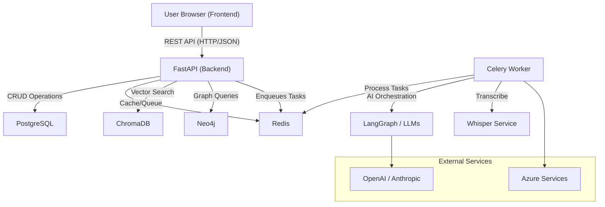
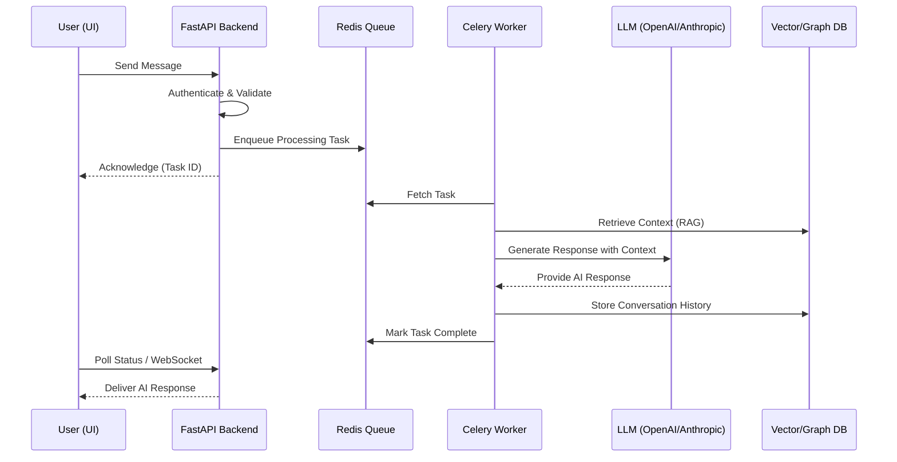

# Architecture Diagrams

This document contains the system architecture and communication diagrams for GenAssist, rendered using [Mermaid](https://mermaid.js.org/).

---

## 🛠 System Interaction Diagram

This diagram illustrates the high-level communication between major system components.

---

## 🔄 Data Flow: Chat Interaction

This sequence diagram shows the flow of a typical chat request, highlighting the asynchronous task processing.

